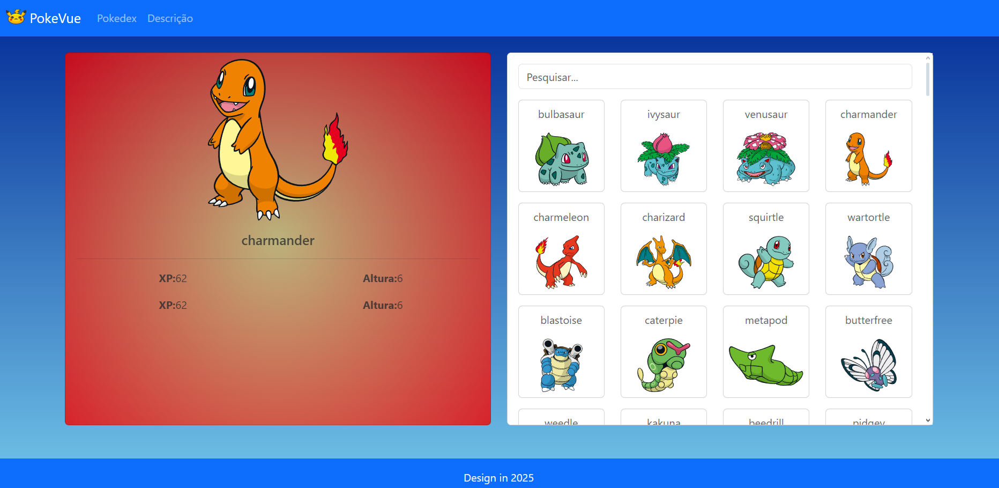

# Pokevue - Pokédex em Vue.js



## 🚀 Visão Geral
Uma Pokédex interativa desenvolvida com Vue.js 3 que permite explorar informações detalhadas sobre Pokémons, incluindo estatísticas, habilidades e tipos.

## ✨ Funcionalidades
-Listagem completa de Pokémons (1ª geração)

-Visualização detalhada de cada Pokémon

-Busca por nome

-Design responsivo para todos os dispositivos

-PWA (Progressive Web App)

## 🛠️ Tecnologias Utilizadas
- **Frontend**:
    -Vue 3 (Composition API)
    
    -Fetch (Gerenciamento de estado)
    
    -Vue Router (Navegação)
    
    -Axios (Requisições HTTP)
    
    -Bootstrap 5 (Estilização)
- **Ferramentas**:
  - Vite (Build tool)
  - ESLint + Prettier (Padronização de código)

## 📦 Instalação

1. Clone o repositório:
```bash
git clone https://github.com/Maniery/Pokevue.git
cd Pokevue "para entrar na pasta da aplicação"
npm install "Instale as dependências"
npm run dev "rode o servidor da aplicação"